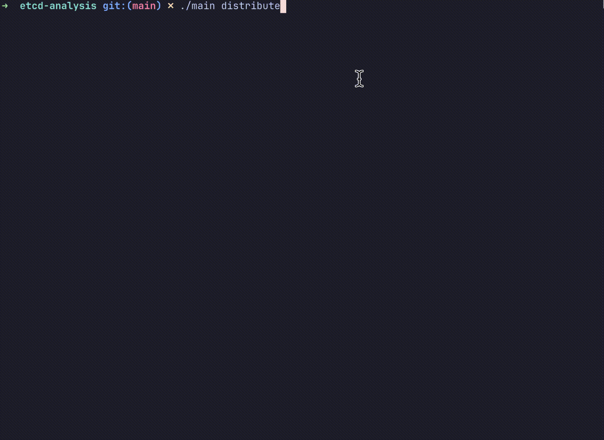

# etcd-analysis
etcd is generally used to store system metadata or service discovery, and is suitable for storing small key-value pairs. At the same time, etcd is sensitive to the size of key-value pairs. When storing large key-value pairs, if the number is too large, it will bring many adverse effects, such as the stability of the watch function is reduced, and a large amount of memory is occupied.

When testing the stability of the system, it may be necessary to pay attention to the size distribution of the data currently stored in etcd by the system. That's why this project came about.

# 🌟 New Function: unmarshal

**implement proto.Unmarshal byte array through proto source file**

Generally speaking, we store some system meta formation in etcd, and the stored pseudocode is:

```go
segBytes, _ := proto.Marshal(*foopb.SystemInfo{})
etcdclient.put("foo/system", segBytes)
```

When we query, we cannot clearly see the value in the struct. Of course, it can be easily implemented through code. You only need to import the relevant pb file and then call the proto.Unmarshal method to see the clear value. But many times we may not have the environment, or writing this part of the code will waste a little time.

The unmarshal instruction will solve this trouble. You only need to copy the proto source file to quickly view the value in the struct. The example:

```
➜ etcdctl+ unmarshal --key by-dev/meta/channelwatch/4/by-dev-rootcoord-dml_0_445337303926193462v0 --import-path ../birdwatcher/proto/v2.2 --proto ../birdwatcher/proto/v2.2/data_coord.proto --full-message-name milvus.protov2.data.ChannelWatchInfo

vchan: collectionID:445337303926193462 channelName:"by-dev-rootcoord-dml_0_445337303926193462v0" seek_position:<channel_name:"by-dev-rootcoord-dml_0" msgID:"\010?\020\223\261\002\030\000 \000" msgGroup:"datanode-3-by-dev-rootcoord-dml_0_445337303926193462v0-true" timestamp:445342561987461121> flushedSegmentIds:445337303926393472
startTs: 1698912217
state: 3
timeoutTs: 0
schema: name:"foo" description:"hello_milvus is the simplest demo to introduce the APIs" fields:<fieldID:100 name:"pk" is_primary_key:true data_type:VarChar type_params:<key:"max_length" value:"100">> fields:<fieldID:101 name:"random" data_type:Double> fields:<fieldID:102 name:"embeddings" data_type:FloatVector type_params:<key:"dim" value:"8">> fields:<name:"RowID" description:"row id" data_type:Int64> fields:<fieldID:1 name:"Timestamp" description:"time stamp" data_type:Int64>
progress: 0
```

<details>
<summary><h1>Getting started</h1></summary>

## Getting the source code

Clone this code repository

```shell
$ git clone https://github.com/SimFG/etcd-analysis.git
```

## Build

Compile code into executable

```shell
$ go build -o etcdctl+
```

## Usage

Get help with functions

```shell
$ etcdctl+ distribute -h
```

</details>

<details open>
<summary><h1>Function List</h1></summary>


1. **distribute** View data distribution according to data size
2. **look** Show or export all the etcd data, and be used with terminal or loki
3. **find** Get key based on certain characters
4. **leader** Get the leader node info
5. **clear** Clear all the etcd data
6. **decode** Base64Decode the etcd value that is encoded 
7. **rename** Rename the etcd data key
8. **unmarshal** Implement proto.Unmarshal byte array through proto source file

## distribute

View data distribution in etcd according to the `key` size , `value` size or `key + value` size by setting the `type` command param.



```shell
$ etcdctl+ distribute

Summary:
  Count:        116.
  Total:        7.3 KB.
  Smallest:     22.0 B.
  Largest:      85.0 B.
  Average:      64.0 B.

Size histogram:
  22.0 B [1]    |
  34.0 B [6]    |∎∎∎
  46.0 B [29]   |∎∎∎∎∎∎∎∎∎∎∎∎∎∎∎∎∎
  58.0 B [13]   |∎∎∎∎∎∎∎
  70.0 B [1]    |
  85.0 B [66]   |∎∎∎∎∎∎∎∎∎∎∎∎∎∎∎∎∎∎∎∎∎∎∎∎∎∎∎∎∎∎∎∎∎∎∎∎∎∎∎∎

Size distribution:
  10% in 38.0 B.
  25% in 39.0 B.
  50% in 76.0 B.
  75% in 83.0 B.
  90% in 85.0 B.
```

## look
Get all data in etcd, and you can use system tools to search.
```shell
$ etcdctl+ look | more

Current Stage
  cluster_id:2037210783374497686 member_id:13195394291058371180 revision:254946 raft_term:9 
Kv List
| Key | Value | CreateRevision | ModRevision | Version | Lease |
| by-dev/kv/gid/idTimestamp | - | 253775 | 254802 | 12 | 0 |
```
- Case 1:  Get all data continuously and display it on the console
```shell
$ etcdctl+ look --write-out=file --hang=true

# New Terminal
$ vim analysis.txt
# update the file in vim, using `:e`
```
- Case 2:  Get the kv data of the specified size range.
```shell
$ etcdctl+ look --filter=key --filter-min=74 --filter-max=100

Current Stage
  cluster_id:2037210783374497686 member_id:13195394291058371180 revision:326021 raft_term:14 
Kv List
| Key | Value | CreateRevision | ModRevision | Version | Lease |
| by-dev/meta/channelwatch/-9223372036854775808/by-dev-rootcoord-dml_4_435191634150817793v0 | - | 326013 | 326013 | 1 | 0 |
```

## find

Get key based on certain characters

```shell
$ ./etcdctl+ find --key=index
Kv List
| Key | Value |
| by-dev/meta/field-index/438660758500016136/438660903999573339 |  |
| by-dev/meta/segment-index/438660758500016136/438660758500016137/438660758500216145/438660903999573340 |  |
| by-dev/meta/segment-index/438660758500016136/438660758500016137/438660758500216146/438660903999573341 |  |
| by-dev/meta/segment-index/438660758500016136/438660758500016137/438672571137461581/438672571137461597 |  |
| by-dev/meta/segment-index/438660758500016136/438660758500016137/438672571137461582/438672571137461598 |  |
```

## leader

Get the leader node info

```shell
$ etcdctl+ leader

Name: default
ClientUrls: [http://127.0.0.1:2379]
```

## clear

Clear all etcd data

```shell
$ etcdctl+ clear

Clear All Data, (Y/n):
```

## unmarshal

Implement proto.Unmarshal byte array through proto source file.

```
$ etcdctl+ unmarshal --key by-dev/meta/channelwatch/4/by-dev-rootcoord-dml_0_445337303926193462v0 --import-path ../birdwatcher/proto/v2.2 --proto ../birdwatcher/proto/v2.2/data_coord.proto --full-message-name milvus.protov2.data.ChannelWatchInfo
```

- key: the etcd full key
- import-path: all proto directory
- proto: the proto file path where the message is located
- full-message-name: the full message name, usually a combination of proto package name and message

</details>

# All contributors

<a href="https://github.com/SimFG/etcd-analysis/graphs/contributors">
  
</a>

# Stargazers over time

[](https://starchart.cc/SimFG/etcd-analysis)
